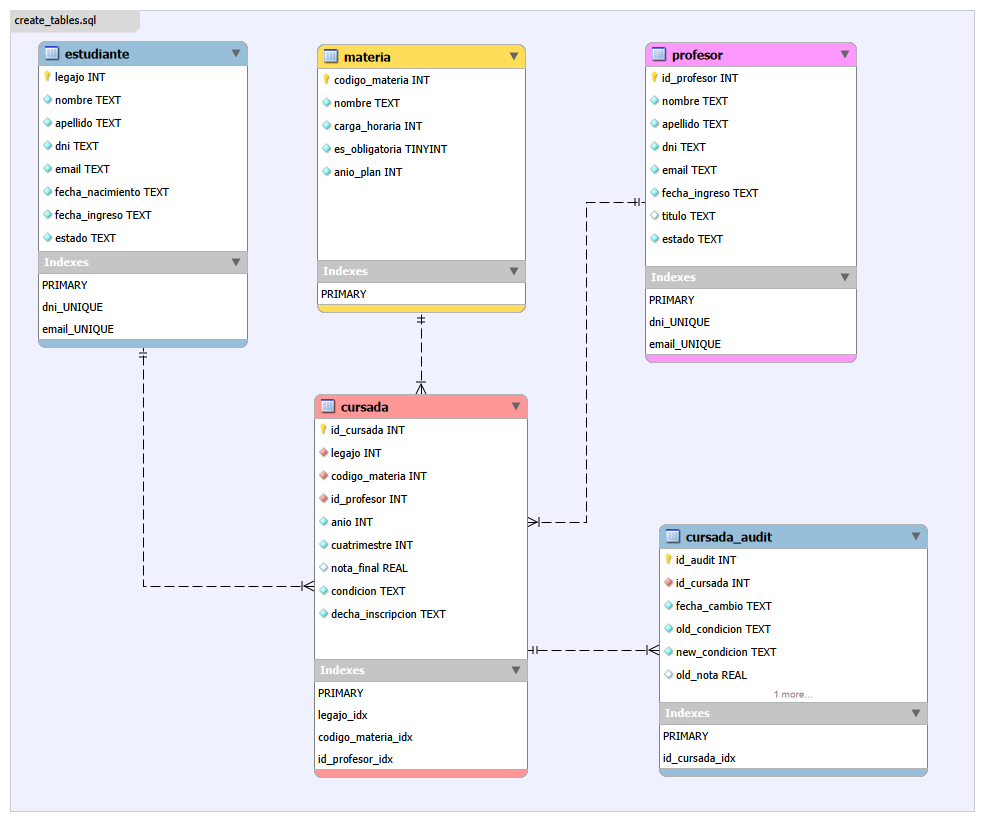

# SQL University Management

Sistema de gestión académica universitario hecho en **SQLite**. El proyecto modela estudiantes, profesores, materias y cursadas, e incluye reglas de integridad, auditoría de cambios y consultas analíticas.

## Objetivos del proyecto

- Diseñar un esquema relacional con restricciones de negocio realistas.
- Garantizar consistencia con `CHECK`, claves foráneas y triggers.
- Proveer consultas útiles para control académico y reportes.
- Incluir datos de ejemplo para pruebas rápidas.

## Modelo de datos

Entidades principales:

- **estudiante**: datos personales y estado académico.
- **profesor**: datos de docentes y situación laboral.
- **materia**: asignaturas del plan y su carga horaria.
- **cursada**: inscripción/rendimiento por materia, año y cuatrimestre.
- **cursada_audit**: histórico de cambios de condición y nota.

Diagrama ER:



## Estructura del repositorio

```text
schema/
  create_tables.sql      # Tablas y constraints
  indexes.sql            # Índices para optimizar consultas
  views.sql              # Vistas analíticas
triggers/
  integridad_trigger.sql # Validaciones de condición/nota
  audit_trigger.sql      # Auditoría de cambios en cursada
data/
  insert_sample_data.sql # Datos de ejemplo
queries/
  consultas_utiles.sql   # Consultas frecuentes de uso operativo
  consultas_control.sql  # Controles de calidad/integridad
  reportes.sql           # Reportes académicos analíticos
```

## Requisitos

- `sqlite3` (CLI) versión reciente.

Verificar instalación:

```bash
sqlite3 --version
```

## Puesta en marcha rápida

### 1) Crear base nueva

```bash
sqlite3 university.db < schema/create_tables.sql
sqlite3 university.db < schema/indexes.sql
sqlite3 university.db < schema/views.sql
sqlite3 university.db < triggers/integridad_trigger.sql
sqlite3 university.db < triggers/audit_trigger.sql
sqlite3 university.db < data/insert_sample_data.sql
```

### 2) Ejecutar consultas

```bash
sqlite3 university.db < queries/consultas_utiles.sql
sqlite3 university.db < queries/consultas_control.sql
sqlite3 university.db < queries/reportes.sql
```


## Reglas de negocio implementadas

### Constraints de tablas

- DNI de estudiantes/profesores: exactamente 8 dígitos y distinto de `00000000`.
- Estados permitidos:
  - Estudiante: `activo`, `inactivo`.
  - Profesor: `activo`, `licencia`, `retirado`.
- `carga_horaria > 0` y `anio_plan` entre 1 y 5.
- `cuatrimestre` en `{1, 2}` y `nota_final` en rango `[0, 10]`.
- Unicidad de cursada por `(legajo, codigo_materia, anio, cuatrimestre)`.

### Triggers de integridad

Los triggers validan coherencia entre `condicion` y `nota_final` en `INSERT` y `UPDATE` de `cursada`:

- `inscripto`, `regular`, `recursa` y `libre` no admiten nota.
- `aprobado` requiere nota no nula y `>= 4`.

### Trigger de auditoría

Cada cambio en `condicion` o `nota_final` de `cursada` inserta un registro en `cursada_audit` con valores anteriores y nuevos.

## Vistas incluidas

- `analitico_estudiantes`: detalle de cursadas con estudiante, materia y profesor.
- `resumen_academico`: métricas por alumno (total cursadas, aprobadas, en curso, promedio).

## Ejemplos de consulta

```sql
-- Promedio académico por estudiante (vista)
SELECT *
FROM resumen_academico
ORDER BY promedio_nota DESC
LIMIT 10;
```

```sql
-- Historial de cambios auditados
SELECT id_cursada, fecha_cambio, old_condicion, new_condicion, old_nota, new_nota
FROM cursada_audit
ORDER BY fecha_cambio DESC;
```
